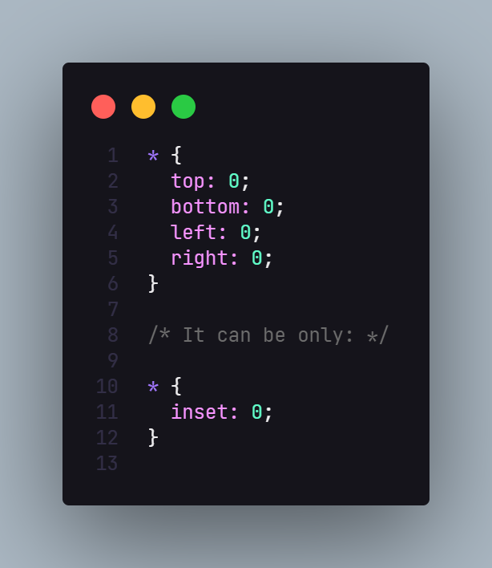

# css-tips
Here I'll post some css tricks so we can improve our coding knowledge, together.

## 001 - Inset property 

## 002 - CSS Color Variables

## 003 - Inset Drop Shadow

## 004 - Line Clamp

## 005 - Gamer Button

## 006 - Backdrop Blur

## 007 - Accent Color

## 008 - Box-shadow vs drop shadow

## 009 - Clamp

## 010 - CSS is

## 011 - Border Radius 

